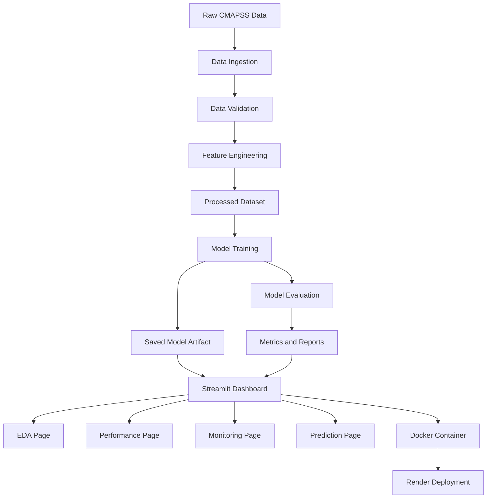
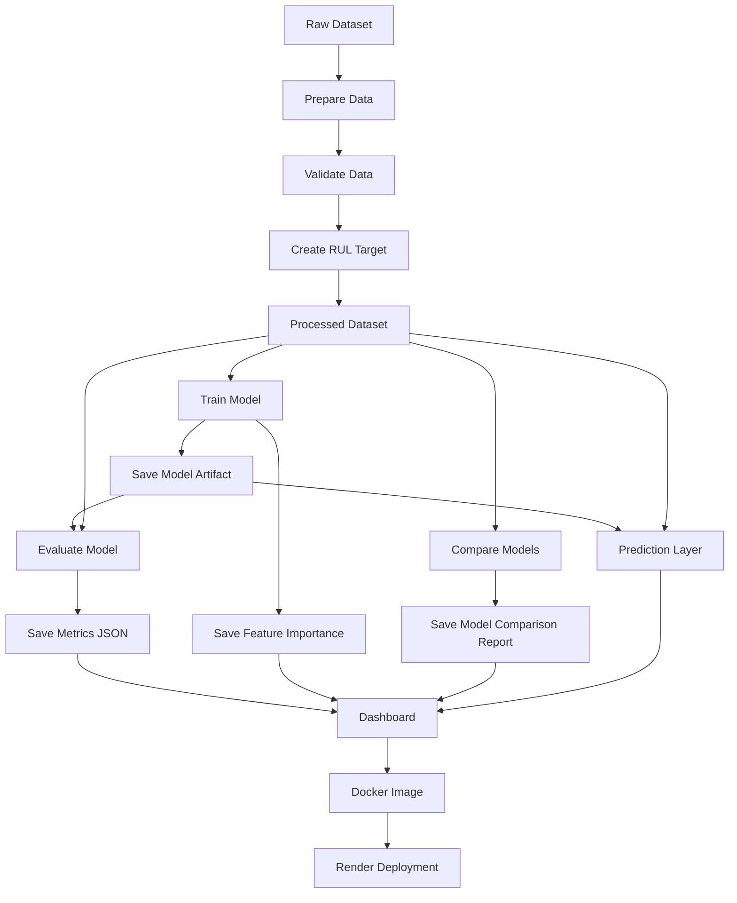

# Industrial Predictive Maintenance MLOps Pipeline

## 1. Overview

This project is an end-to-end **Industrial Predictive Maintenance MLOps Pipeline** built using the **NASA CMAPSS FD001 turbofan engine degradation dataset**.

The objective is to predict the **Remaining Useful Life (RUL)** of aircraft engines using operational settings and sensor measurements.

The project includes a complete machine learning workflow:

* data ingestion,
* data validation,
* feature engineering,
* model training,
* model comparison,
* model evaluation,
* experiment tracking,
* monitoring simulation,
* dashboard-based prediction,
* Docker containerization,
* and cloud deployment.

The final application is deployed as an interactive **Streamlit dashboard** using **Docker** and **Render**.

---

## 2. Motivation

Unexpected machine failures in industrial systems can cause downtime, safety risks, and high maintenance costs.

Traditional maintenance approaches are often reactive or schedule-based. Predictive maintenance improves this by using sensor data to estimate machine health and predict when failure may occur.

This project simulates an industrial AI workflow where machine learning is used to predict aircraft engine Remaining Useful Life and support maintenance decision-making.

---

## 3. Success Metrics

Since RUL prediction is a regression problem, the model is evaluated using the following metrics:

| Metric   | Description                                                 |
| -------- | ----------------------------------------------------------- |
| MAE      | Average absolute error between actual and predicted RUL     |
| RMSE     | Penalizes larger prediction errors more strongly            |
| R² Score | Measures how much variance in RUL is explained by the model |

The baseline deployed model is a **Random Forest Regressor**.

| Metric   |   Value |
| -------- | ------: |
| MAE      | 10.9488 |
| RMSE     | 16.1515 |
| R² Score |  0.8462 |

An MAE of approximately **11 cycles** means the model predicts Remaining Useful Life with an average error of around 11 engine cycles.

---

## 4. Requirements and Constraints

### 4.1 Functional Requirements

The system should be able to:

* load raw CMAPSS FD001 engine data,
* validate raw data quality,
* create the Remaining Useful Life target,
* generate a processed training dataset,
* train regression models,
* compare multiple models,
* evaluate model performance,
* save trained model artifacts,
* provide dashboard-based RUL prediction,
* simulate monitoring reports,
* and deploy the application as a web service.

### 4.2 Non-Functional Requirements

The system should be:

* modular and maintainable,
* reproducible using DVC,
* interpretable through metrics and feature importance,
* deployable using Docker,
* easy to use through an interactive dashboard,
* suitable for future production extensions.

### 4.3 Constraints

The current version has the following constraints:

* only the FD001 subset of NASA CMAPSS is used,
* the deployed model is a Random Forest Regressor,
* monitoring is simulated using reference/current data splits,
* live sensor streaming is not included,
* actual production labels are delayed until failure events occur.

### 4.4 Out of Scope

The following are not included in the current version:

* real-time sensor ingestion,
* production database logging,
* automated retraining,
* CI/CD automation,
* Kubernetes deployment,
* authentication,
* live alerting system,
* full production model registry workflow.

---

## 5. Methodology

### 5.1 Problem Statement

Given aircraft engine operational settings and sensor readings at a particular cycle, predict the engine’s **Remaining Useful Life**.

This is a supervised regression problem.

| Component    | Description                                        |
| ------------ | -------------------------------------------------- |
| Input        | Operational settings, sensor readings, time cycles |
| Target       | Remaining Useful Life                              |
| Output       | Predicted cycles remaining before failure          |
| Problem Type | Regression                                         |

### 5.2 Data

The project uses the **NASA CMAPSS FD001 dataset**.

Each row represents one engine at one operating cycle.

The dataset contains:

* engine unit number,
* time in cycles,
* 3 operational settings,
* 21 sensor measurements.

The target variable is engineered as:

```text
RUL = max_cycle_for_engine - current_cycle
```

The RUL value is capped at **125 cycles** to reduce the effect of very large early-life RUL values.

Dataset summary:

| Item              |  Value |
| ----------------- | -----: |
| Rows              | 20,631 |
| Original Columns  |     26 |
| Processed Columns |     27 |
| Engine Units      |    100 |

### 5.3 Techniques

The project uses the following techniques:

* data ingestion using pandas,
* data validation checks,
* RUL target engineering,
* RUL capping,
* exploratory data analysis,
* boxplot and sensor distribution analysis,
* hypothesis testing between healthy and near-failure engine states,
* regression model training,
* model comparison,
* feature importance analysis,
* residual analysis,
* simulated drift monitoring,
* Docker-based deployment.

Models compared:

* Linear Regression,
* Ridge Regression,
* Decision Tree Regressor,
* Random Forest Regressor,
* Gradient Boosting Regressor.

---

## 6. Architecture

The project follows a modular machine learning architecture.



### MLOps Components

| Component  | Purpose                               |
| ---------- | ------------------------------------- |
| Git/GitHub | Source code versioning                |
| DVC        | Pipeline and artifact reproducibility |
| MLflow     | Experiment tracking                   |
| Streamlit  | Interactive dashboard                 |
| Docker     | Containerization                      |
| Render     | Cloud deployment                      |

---

## 7. Pipeline

The pipeline is organized into multiple stages.



### Main Pipeline Stages

#### 1. Prepare Data

Loads the raw CMAPSS data, validates it, creates the RUL target, caps RUL values, and saves the processed dataset.

```bash
python -m src.create_dataset
```

#### 2. Train Model

Trains the Random Forest Regressor and saves the model artifact.

```bash
python -m src.models.train_model
```

#### 3. Evaluate Model

Evaluates the saved model and stores evaluation metrics.

```bash
python -m src.evaluation.evaluate_model
```

#### 4. Compare Models

Trains and compares multiple regression models.

```bash
python -m src.models.compare_models
```

#### 5. Run Full DVC Pipeline

```bash
dvc repro
```

#### 6. Show Metrics

```bash
dvc metrics show
```

---

## 8. Conclusion

This project demonstrates a complete predictive maintenance workflow with an MLOps-first design.

It covers the full lifecycle from raw data processing to model deployment:

* raw data ingestion,
* validation,
* feature engineering,
* model training,
* model comparison,
* evaluation,
* dashboard inference,
* monitoring simulation,
* Docker containerization,
* and Render deployment.

The project shows how machine learning can be applied to industrial sensor data to estimate equipment health and support maintenance planning.

Future improvements include:

* FastAPI inference service,
* real prediction logging,
* production database integration,
* Evidently AI drift reports,
* automated retraining,
* CI/CD pipeline,
* cloud DVC remote,
* and model registry integration.
